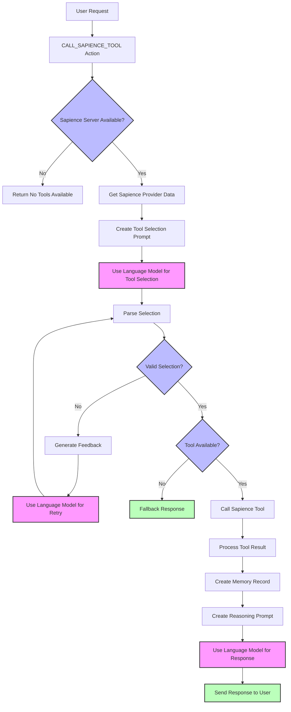

# ElizaOS Plugin for Sapience

[](https://conventionalcommits.org)

This plugin for ElizaOS provides seamless integration with the Sapience API, allowing your agent to leverage its powerful tools and resources.

## 📦 Installation

Install the plugin in your ElizaOS project:

- **npm**

```bash
npm install @elizaos/plugin-sapience
```

- **pnpm**

```bash
pnpm install @elizaos/plugin-sapience
```

- **yarn**

```bash
yarn add @elizaos/plugin-sapience
```

- **bun**

```bash
bun add @elizaos/plugin-sapience
```

## 🚀 Key Features

This plugin provides three main capabilities:

### 1. **MCP Data Integration** 📊
- Connects to the Sapience MCP endpoint to access market data
- Provides calldata for blockchain transactions
- Includes tools for querying positions, prices, and market information

### 2. **Transaction Simulation** 🧪
- **Action**: `SIMULATE_TRANSACTION`
- Simulates blockchain transactions without submitting them
- Provides gas estimates and checks for potential errors
- **Private Key**: Optional (uses actual caller address if available for more accurate simulation)

### 3. **Transaction Submission** 🚀
- **Action**: `SUBMIT_TRANSACTION`
- Submits blockchain transactions to the network
- **Private Key**: **Required** in environment variables (`PRIVATE_KEY`)
- Handles gas estimation automatically

## 🔧 Configuration

### Environment Variables
- `PRIVATE_KEY`: Required for transaction submission, optional for simulation
- `RPC_URL`: Optional (defaults to Base mainnet)

### Basic Setup

This plugin works out of the box by automatically connecting to the Sapience API. No configuration is required for MCP data access.

If you need to override the default Sapience configuration or add other servers, you can do so in your character configuration file:

```json
{
  "name": "Your Character",
  "plugins": ["@elizaos/plugin-sapience"],
  "settings": {
    "sapience": {
      "servers": {
        "sapience": {
          "type": "streamable-http",
          "url": "https://custom-sapience.foil.network/mcp"
        },
        "another-server": {
          "type": "http",
          "url": "https://another-mcp-server.com"
        }
      }
    }
  }
}
```

## 📖 Quick Start Examples

### Getting Market Data
```
"Show me the current markets available"
"What's the price of ETH in market 1?"
```

### Creating and Testing Transactions
```
"Create a trader position for market 1 with 100 USDC collateral"
"Simulate this transaction before I submit it"
"Submit this transaction to the blockchain"
```

### Environment Setup
```bash
export PRIVATE_KEY="0x..."  # Required for transaction submission
export RPC_URL="https://..."  # Optional, defaults to Base mainnet
```

## 🛠️ Using Sapience Capabilities

Once configured, the plugin automatically exposes the Sapience server's capabilities to your agent:

### Context Provider

The plugin includes one provider that adds Sapience capabilities to the agent's context:

1.  **`Sapience`**: Lists available tools and resources from the MCP endpoint.

### Actions

The plugin provides four actions for comprehensive blockchain interaction:

1.  **`CALL_SAPIENCE_TOOL`**: Executes tools from the Sapience MCP server (market data, generate calldata).
2.  **`READ_SAPIENCE_RESOURCE`**: Accesses resources from the Sapience MCP server.
3.  **`SIMULATE_TRANSACTION`**: Simulates blockchain transactions for testing and gas estimation.
4.  **`SUBMIT_TRANSACTION`**: Submits blockchain transactions to the network.

### Typical Workflow

1. **Query Market Data**: Use `CALL_SAPIENCE_TOOL` to get market information
2. **Generate Transaction**: Use `CALL_SAPIENCE_TOOL` to create transaction calldata
3. **Test Transaction**: Use `SIMULATE_TRANSACTION` to verify the transaction
4. **Submit Transaction**: Use `SUBMIT_TRANSACTION` to execute on-chain

## 🔄 Plugin Flow

The following diagram illustrates the plugin's flow for tool selection and execution:



## 📋 Example: Default and Custom Setups

By default, no configuration is needed. The plugin will automatically connect to the Sapience API.

To add another server while keeping the default Sapience server, you can do the following:

```json
{
  "name": "Developer Assistant",
  "plugins": ["@elizaos/plugin-sapience"],
  "settings": {
    "sapience": {
      "servers": {
        "another-server": {
          "type": "streamable-http",
          "url": "https://another-mcp-server.com"
        }
      }
    }
  }
}
```

To override the default Sapience server, simply define a server with the name `sapience`:

```json
{
  "name": "Developer Assistant",
  "plugins": ["@elizaos/plugin-sapience"],
  "settings": {
    "sapience": {
      "servers": {
        "sapience": {
          "type": "streamable-http",
          "url": "https://custom.sapience.url/mcp"
        }
      }
    }
  }
}
```

## 🔒 Security Considerations

Please be aware that the Sapience server can execute arbitrary code, so only connect to servers you trust.

## 🔍 Troubleshooting

If you encounter issues with the Sapience plugin:

1.  Check that your server is correctly configured and running.
2.  Ensure the server URL is accessible in the ElizaOS environment.
3.  Review the logs for connection errors.
4.  Verify that the plugin is properly loaded in your character configuration.

## 👥 Contributing

Thanks for considering contributing to our project!

### How to Contribute

1.  Fork the repository.
2.  Create a new branch: `git checkout -b feature-branch-name`.
3.  Make your changes.
4.  Commit your changes using conventional commits.
5.  Push to your fork and submit a pull request.

### Commit Guidelines

We use [Conventional Commits](https://www.conventionalcommits.org/) for our commit messages:

- `test`: 💍 Adding missing tests
- `feat`: 🎸 A new feature
- `fix`: 🐛 A bug fix
- `chore`: 🤖 Build process or auxiliary tool changes
- `docs`: ✏️ Documentation only changes
- `refactor`: 💡 A code change that neither fixes a bug or adds a feature
- `style`: 💄 Markup, white-space, formatting, missing semi-colons...

## 📄 License

This plugin is released under the same license as ElizaOS.
