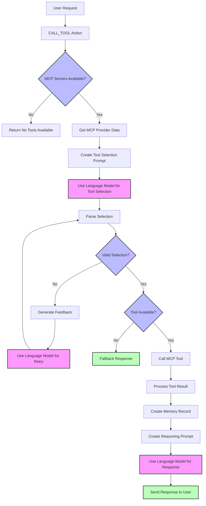

# MCP Plugin for ElizaOS

[](https://conventionalcommits.org)

This plugin integrates the Model Context Protocol (MCP) with ElizaOS, allowing agents to connect to multiple MCP servers and use their resources, prompts, and tools.

## 🔍 What is MCP?

The [Model Context Protocol](https://modelcontextprotocol.io) (MCP) is an open protocol that enables seamless integration between LLM applications and external data sources and tools. It provides a standardized way to connect LLMs with the context they need.

This plugin allows your ElizaOS agents to access multiple MCP servers simultaneously, each providing different capabilities:

- **Resources**: Context and data for the agent to reference
- **Prompts**: Templated messages and workflows
- **Tools**: Functions for the agent to execute

## 📦 Installation

Install the plugin in your ElizaOS project:

- **npm**

```bash
npm install @elizaos/plugin-mcp
```

- **pnpm**

```bash
pnpm install @elizaos/plugin-mcp
```

- **yarn**

```bash
yarn add @elizaos/plugin-mcp
```

- **bun**

```bash
bun add @elizaos/plugin-mcp
```

## 🚀 Usage

1. Add the plugin to your character configuration:

```json
{
  "name": "Your Character",
  "plugins": ["@elizaos/plugin-mcp"],
  "settings": {
    "mcp": {
      "servers": {
        "github": {
          "type": "stdio",
          "name": "Code Server",
          "command": "npx",
          "args": ["-y", "@modelcontextprotocol/server-github"]
        }
      }
    }
  }
}
```

## ⚙️ Configuration Options

MCP supports two types of servers: "stdio" and "sse". Each type has its own configuration options.

### Common Options

| Option     | Type    | Description                                     |
| ---------- | ------- | ----------------------------------------------- |
| `type`     | string  | The type of MCP server: "stdio" or "sse"        |
| `name`     | string  | The display name of the server                  |
| `timeout`  | number  | Timeout in seconds for tool calls (default: 60) |
| `disabled` | boolean | Whether the server is disabled                  |

### stdio Server Options

| Option    | Type     | Description                                       |
| --------- | -------- | ------------------------------------------------- |
| `command` | string   | The command to run the MCP server                 |
| `args`    | string[] | Command-line arguments for the server             |
| `env`     | object   | Environment variables to pass to the server       |
| `cwd`     | string   | _Optional_ Working directory to run the server in |

### sse Server Options

| Option    | Type   | Description                            |
| --------- | ------ | -------------------------------------- |
| `url`     | string | The URL of the SSE endpoint            |

## 🛠️ Using MCP Capabilities

Once configured, the plugin automatically exposes MCP servers' capabilities to your agent:

### Context Providers

The plugin includes three providers that add MCP capabilities to the agent's context:

1. `MCP_SERVERS`: Lists available servers and their tools, resources and prompts

## 🔄 Plugin Flow

The following diagram illustrates the MCP plugin's flow for tool selection and execution:



## 📋 Example: Setting Up Multiple MCP Servers

Here's a complete example configuration with multiple MCP servers of both types:

```json
{
  "name": "Developer Assistant",
  "plugins": ["@elizaos/plugin-mcp", "other-plugins"],
  "settings": {
    "mcp": {
      "servers": {
        "github": {
          "command": "npx",
          "args": ["-y", "@modelcontextprotocol/server-github"],
          "env": {
            "GITHUB_PERSONAL_ACCESS_TOKEN": "<YOUR_TOKEN>"
          }
        },
        "puppeteer": {
          "command": "npx",
          "args": ["-y", "@modelcontextprotocol/server-puppeteer"]
        },
        "google-maps": {
          "command": "npx",
          "args": ["-y", "@modelcontextprotocol/server-google-maps"],
          "env": {
            "GOOGLE_MAPS_API_KEY": "<YOUR_API_KEY>"
          }
        }
      },
      "maxRetries": 2
    }
  }
}
```

## 🔒 Security Considerations

Please be aware that MCP servers can execute arbitrary code, so only connect to servers you trust.

## 🔍 Troubleshooting

If you encounter issues with the MCP plugin:

1. Check that your MCP servers are correctly configured and running
2. Ensure the commands are accessible in the ElizaOS environment
3. Review the logs for connection errors
4. Verify that the plugin is properly loaded in your character configuration

## 👥 Contributing

Thanks for considering contributing to our project!

### How to Contribute

1. Fork the repository.
2. Create a new branch: `git checkout -b feature-branch-name`.
3. Make your changes.
4. Commit your changes using conventional commits.
5. Push to your fork and submit a pull request.

### Commit Guidelines

We use [Conventional Commits](https://www.conventionalcommits.org/) for our commit messages:

- `test`: 💍 Adding missing tests
- `feat`: 🎸 A new feature
- `fix`: 🐛 A bug fix
- `chore`: 🤖 Build process or auxiliary tool changes
- `docs`: ✏️ Documentation only changes
- `refactor`: 💡 A code change that neither fixes a bug or adds a feature
- `style`: 💄 Markup, white-space, formatting, missing semi-colons...

## 📄 License

This plugin is released under the same license as ElizaOS.
